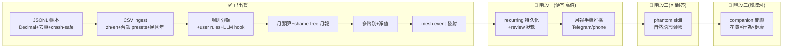

> ARCHIVED 2026-06-19 — 內容已併入 docs/phantom-finance.md;此為歷史版本。

# phantom-finance 路線圖(繁體中文視覺版)

> **一行定位:** phantom-finance 是 phantom-mesh 生活夥伴拼圖的**財務塊** —
> 銀行 CSV 丟進來、規則(+ 可選 LLM)自動分類、寫成 shame-free 月報、再變成
> **mesh event** 讓 companion 把「花費 × 行為 × 健康」放同一張圖看,資料永遠在你機器上。
>
> **護城河:** 不是再做一個記帳 app,而是**私有、本機、會發事件的生活軌跡財務塊** —
> 整合 + 主權(local-first)+ 台灣/繁中/台灣銀行貼合,而非功能廣度。
>
> ⭐ **真相來源是英文版 [`ROADMAP.md`](./ROADMAP.md)**(grounded 在真實 commit)。
> 本檔是視覺化導覽;狀態有衝突時以 `ROADMAP.md` 為準。OSS 選型細節見
> [`docs/OSS-LANDSCAPE-AND-DIRECTION.md`](./docs/OSS-LANDSCAPE-AND-DIRECTION.md)。

## 圖例

| 符號 | 意思 |
| --- | --- |
| ✅ | 已出貨(英文 ROADMAP 有對應 commit) |
| 🚧 | 階段一:便宜、高值、不需新依賴 |
| 📅 | 階段二:讓資料可被問答 |
| 🔭 | 階段三:護城河(companion 關聯),較遠 |
| 🧭 | OSS 選型 = **候選方向**,非英文 SSOT 承諾 |

## ① 狀態流(Mermaid)

## ② 分期表

> 排序原則(單人多機開發運作模型):**便宜高值先 → 護城河先 → 裝置/真錢/操作者決策後**。
> 寫=codex/claude,審=codex+agy+claude(≥2 distinct-AI),把關=governor + 高風險雙閘 → 手機核准。

### 🚧 階段一 — 把迴圈用最低成本收尾(grounded 在 ROADMAP「Planned-next」)

| 目標 | 具體項 | 在哪台機 + 哪個 AI | 風險 / 前置 |
| --- | --- | --- | --- |
| 讓 recurring 偵測變成可審狀態 | `recurring.json` 持久化 + 每筆 review 狀態(new/reviewed/ignored)+ `recurring review`/`recurring list` | orchestrator node (Win) 編排把關;寫 codex/claude,審 codex+agy | 純本機、無新依賴;低風險。已有開發分支(見英文 ROADMAP) |
| 月報送到手機 | 把現有 monthly-report event 推到 Telegram/phone(沿用 mesh,不開新 app) | orchestrator node (Win) 編排;an Android worker 驗推送 | 需 mesh 通知通道;不可變成另一個要維護的 app(over-build) |

### 📅 階段二 — 讓資料可被問答

| 目標 | 具體項 | 在哪台機 + 哪個 AI | 風險 / 前置 |
| --- | --- | --- | --- |
| 自然語言問帳 | `phantom skill`:回答「這個月外食多少?」用 skill 而非寫死指令,走 mesh model router / Ollama | orchestrator node (Win) 編排;a Windows node on-demand 跑 Python | LLM 必須**預設 off + offline-safe**(現有 `llm.py` 已是);🧭 候選參考 `simonw/llm` 的 provider 形狀,**非依賴** |

### 🔭 階段三 — 護城河(較遠)

| 目標 | 具體項 | 在哪台機 + 哪個 AI | 風險 / 前置 |
| --- | --- | --- | --- |
| 花費 × 行為 × 健康關聯 | companion 端 correlation 模組,消費 phantom-finance 發出的 events | orchestrator node (Win) 編排;a Mac node 做 Apple surfaces | **前置 = companion keystone 工作**(跨專案依賴);這是沒有任何 OSS 財務工具在做的事 = 存在理由,要 **build 不 adopt** |
| (僅在真有需求時)PTA 互通 | 可選 Beancount/hledger **匯出**(檔案格式級,非 import) | a Windows node on-demand | 🧭 候選;Beancount/hledger 是 GPL,只能**格式級互通**,import 會 GPL 耦合(見 landscape §5)。多數單人情境永遠用不到 |

## ③ 刻意不做 / over-build 風險

| 不做的事 | 為什麼 |
| --- | --- |
| ❌ 做成完整 web/mobile 記帳 app | Actual(MIT, ~27k★ local-first)/ Firefly III(AGPL, ~24k★)已佔滿這塊;單人去拚會輸且**毀掉利基**。手機只做「月報推播」不做新 app |
| ❌ 採用重量級 AI-finance agent 框架 | 會把依賴方向反過來(本專案該**擁有** pipeline、**使用** model router,而非活在別人的 agent 裡)。本機 LLM 分類已是 commodity,不是護城河 |
| ❌ 自幹 / import 雙式記帳 (PTA) 引擎 | 真要 durable accounting 就**格式級互通** Beancount/hledger,不重寫、不 import(GPL 耦合 + scope creep) |
| ❌ 雲端同步 / SaaS / 存銀行密碼爬 API | 違反主權核心;CSV 匯出是刻意保留的本機路徑(英文 ROADMAP「Non-goals」) |
| ❌ 預設走雲端 LLM 分類 | 會悄悄破壞「資料不出機器」承諾;本機/Ollama 必須是預設,雲端只能明確 opt-in |
| ❌ 投資建議 | 報告只陳述事實,決策留給人(英文 ROADMAP「Non-goals」) |

---

> 本檔不灌水:✅ 區每項都對應英文 [`ROADMAP.md`](./ROADMAP.md) 的真實 commit;
> 🚧/📅/🔭 區對應其「Planned-next」,**尚未出貨**;🧭 OSS 選型皆為候選方向。
