# phantom-finance — 唯一主文件

> 本檔為 phantom-finance 唯一主文件;舊版見 `docs/_archive/`。
> 對應狀態:`master` —— Tier 1→3 全數出貨(JSONL 帳本 / CSV ingest / 規則分類 + LLM hook / 月預算 + shame-free 月報 / 多幣別 + 淨值 / mesh event 發射 / 訂閱漲價告警)。每個「已出貨」項都對應 `master` 上的真實 commit。

## 目錄
- [定位與護城河](#定位與護城河)
- [快速上手](#快速上手)
- [狀態與視覺路線圖](#狀態與視覺路線圖)
- [開源生態與方向](#開源生態與方向)
- [刻意不做 / over-build 風險](#刻意不做--over-build-風險)

---

## 定位與護城河

**phantom-finance 是 phantom-mesh 生活夥伴拼圖的「財務塊」,屬 phantom-mesh 生態系的一部分。** 以 Python 撰寫,封裝為 `phantom-finance`,附帶 CLI(`add`、`import`、`budget`、`report`、`net-worth`、`account`)。

- **它不是再做一個記帳 app。** 而是一條小巧的 **ingest → categorize → report → emit-event** 流水線:銀行 CSV 丟進來、規則(中英文 merchant 都認,+ 可選離線 LLM)自動分類、錢的事實寫成 shame-free 月報,再變成 **mesh event**,讓獨立的 phantom-companion 把「花費 × 行為 × 健康」放在同一張圖上看。資料永遠在你自己機器上(`~/.phantom-mesh/`)。
- **護城河 = 整合 + 主權(local-first)+ 台灣/繁中/台灣銀行貼合,而非功能廣度。** 沒有任何開源財務工具輸出 mesh life-track 事件;也沒有開源工具把台灣銀行(Cathay / CTBC / E.SUN / Taishin)、民國年、`NT$1,234` 解析涵蓋得好。差異化*並非*功能寬度,而是這條會發事件、台灣原生、隱私優先的單一用途流水線。
- **設計原則(跟全生態系一致):**
  - **local-first** —— 沒有雲、沒有上傳,財務資料不出機器;`.gitignore` 直接擋 `ledger.jsonl` / `*.csv` 防手滑 commit。
  - **shame-free by construction** —— 報告只陳述數字(「over plan — worth a look」),羞辱句式在模板層就不存在,有測試擋。
  - **Decimal end-to-end** —— float 在 boundary 就 `TypeError`,金額不會有浮點誤差。

---

## 快速上手

### 30-second quickstart

```bash
git clone https://github.com/markl-a/phantom-finance
cd phantom-finance
pip install -e .

# 手動記一筆(負數 = 支出,跟銀行 CSV 同號制)
phantom-finance add -- -120 "全聯 週末採買"

# 丟銀行對帳單(中英文表頭自動偵測,重複匯入自動去重)
phantom-finance import statement.csv --account cathay

# 台灣銀行 CSV 預設組(Cathay / CTBC / E.SUN / Taishin)+ 民國年自動解析
phantom-finance import cathay.csv --bank cathay

# 設預算、看本月狀態(transfer 類別自動排除)
phantom-finance budget set dining 6000
phantom-finance budget show

# 帳戶 / 淨值(asset 帳戶計入淨值,cash flow 排除)
phantom-finance account add 永豐證券 --type asset
phantom-finance net-worth --currency TWD

# 月報(寫檔 + emit mesh event)
phantom-finance report --month 2026-06

pytest -v
```

報告寫到:

```
~/.phantom-mesh/logs/phantom-finance/<YYYY-MM>-report.md
```

事件發射到:

```
~/.phantom-mesh/events/   (一個目錄 + meta.json,供 phantom-companion 消費)
```

> ⚠️ **Honest caveat**:分類是規則式的 —— 沒見過的中文商家會留在 `uncategorized` 等 `recat` 或 LLM hook。預算 / 報告對 `transfer` 類別自動排除,但轉帳判斷也是規則式,搬大錢前先看一眼分類。LLM 後援**預設 off + offline-safe**,僅在 `PHANTOM_FINANCE_LLM` 啟用且 `phantom_mesh.router` 可 import 時才接上;否則維持純規則。

### 架構(在 phantom-mesh 生態系內)

```
bank CSV / manual add
        |
        v
  ingest.py ──> categorize.py(rules + LLM hook)──> ledger.jsonl(JSONL, Decimal, dedupe)
                                                        |
                              +─────────────────────────+
                              v                         v
                        budget.py(月預算)          reporter.py(shame-free 月報)
                                                        |
                                  +─────────────────────+
                                  v                     v
              ~/.phantom-mesh/logs/phantom-finance/   ~/.phantom-mesh/events/
                                                        |
                                                        v
                                              phantom-companion(keystone)
                                              spend × behavior × health correlation
```

---

## 狀態與視覺路線圖

> 排序原則(單人多機開發運作模型):**便宜高值先 → 護城河先 → 裝置/真錢/操作者決策後**。
> 寫=codex/claude,審=codex+agy+claude(≥2 distinct-AI),把關=governor + 高風險雙閘 → 手機核准。
> 每個「已出貨」項對應 `master` 上的真實 commit。🚧/📅/🔭 區對應 ROADMAP「Planned-next」,**尚未出貨**;🧭 OSS 選型皆為候選方向,非鎖定承諾(具體選型見下方〈開源生態與方向〉)。

### 圖例

| 符號 | 意思 |
| --- | --- |
| ✅ | 已出貨(對應真實 commit) |
| 🚧 | 階段一:便宜、高值、不需新依賴 |
| 📅 | 階段二:讓資料可被問答 |
| 🔭 | 階段三:護城河(companion 關聯),較遠 |
| 🧭 | OSS 選型 = **候選方向**,非承諾 |

### 狀態流(Mermaid)

```mermaid
flowchart LR
    subgraph DONE["✅ 已出貨（master）"]
        A["JSONL 帳本<br/>Decimal+去重+crash-safe"]
        B["CSV ingest<br/>zh/en+台銀 presets+民國年"]
        C["規則分類<br/>+user rules+LLM hook"]
        D["月預算+shame-free 月報"]
        E["多幣別+淨值"]
        F["訂閱漲價告警<br/>→ 月報+event"]
        G["mesh event 發射"]
    end
    subgraph P1["🚧 階段一（便宜高值）"]
        H["recurring 持久化<br/>+review 狀態"]
        I["月報手機推播<br/>Telegram/phone"]
    end
    subgraph P2["📅 階段二（可問答）"]
        J["phantom skill<br/>自然語言問帳"]
    end
    subgraph P3["🔭 階段三（護城河）"]
        K["companion 關聯<br/>花費×行為×健康"]
    end
    A --> B --> C --> D --> E --> F --> G
    G --> H --> I --> J --> K
```



### ✅ 已出貨(grounded,對應真實 commit)

| 項目 | 具體內容 | 對應 commit / 證據 |
|---|---|---|
| 核心帳本 + 報告(Tier 1) | JSONL ledger(`Decimal` 全程、sha256 `txn_id` 去重、冪等重複匯入)、CSV ingest(zh/en 表頭偵測、BOM、`NT$1,234`)、規則分類器(80+ zh/en 關鍵字)+ LLM hook 簽章、月預算(排除 transfer)、shame-free 月報、mesh event 發射 | `891b461`(Tier 1 baseline) |
| 帳本耐久性(Tier 1.5) | crash-safe 寫入:exclusive lock-file + atomic temp/replace + `.bak` 備份(寫到一半當機不會撕裂或損毀帳本) | `498cab3` |
| LLM hook / 台銀 presets / user rules / recurring(Tier 2) | LLM 分類後援接上 phantom-mesh model router(opt-in、offline-safe)、台灣銀行 CSV presets(Cathay/CTBC/E.SUN/Taishin)經 `--bank`、民國年解析、`rules.json` 覆寫、訂閱/漲價偵測 | `2602ec0` `ea0ed3b` `09ee90d` `3d8451d` `7f8284d`(reconcile `d8801ee`) |
| 多幣別 + 淨值(Tier 3) | 匯率(`rates.json` + `convert`)、asset vs cash 帳戶、`account add/list/set-type` 寫 `accounts.json`、`net-worth [--currency]` CLI + 月報淨值/可支配欄位(無重複計算) | `daefed6` `5f969b7` `eae292b` |
| 漲價告警觸達使用者(Tier 2 follow-through) | 月報新增「Subscription price changes」區段(沿用既有 `recurring.price_hikes()`,shame-free 措辭),event payload 帶上偵測到的漲價(修掉 `price_hikes()` 只被測試引用的 dead code) | `7cea460` |

> 目前:Tier 1→3 全數出貨。原始碼已驗對得上(`ledger.py`/`ingest.py`/`presets.py`/`categorize.py`/`llm.py`/`budget.py`/`reporter.py`/`recurring.py`/`networth.py`/`events.py` 皆在)。`master` 上**目前無 in-flight 項目**;存在 recurring 持久化等開發分支(見下方階段一)。

### 🚧 階段一 — 把迴圈用最低成本收尾(grounded 在 ROADMAP「Planned-next」)

| 目標 | 具體項 | 在哪台機 + 哪個 AI | 風險 / 前置 |
| --- | --- | --- | --- |
| 讓 recurring 偵測變成可審狀態 | `recurring.json` 持久化 + 每筆 review 狀態(new/reviewed/ignored)+ `recurring review`/`recurring list` | orchestrator node (Win) 編排把關;寫 codex/claude,審 codex+agy | 純本機、無新依賴;低風險。已有開發分支 |
| 月報送到手機 | 把現有 monthly-report event 推到 Telegram/phone(沿用 mesh,不開新 app) | orchestrator node (Win) 編排;an Android worker 驗推送 | 需 mesh 通知通道;不可變成另一個要維護的 app(over-build) |

### 📅 階段二 — 讓資料可被問答

| 目標 | 具體項 | 在哪台機 + 哪個 AI | 風險 / 前置 |
| --- | --- | --- | --- |
| 自然語言問帳 | `phantom skill`:回答「這個月外食多少?」用 skill 而非寫死指令,走 mesh model router / Ollama | orchestrator node (Win) 編排;a Windows node on-demand 跑 Python | LLM 必須**預設 off + offline-safe**(現有 `llm.py` 已是);🧭 候選參考 `simonw/llm` 的 provider 形狀,**非依賴** |

### 🔭 階段三 — 護城河(較遠)

| 目標 | 具體項 | 在哪台機 + 哪個 AI | 風險 / 前置 |
| --- | --- | --- | --- |
| 花費 × 行為 × 健康關聯 | companion 端 correlation 模組,消費 phantom-finance 發出的 events | orchestrator node (Win) 編排;a Mac node 做 Apple surfaces | **前置 = companion keystone 工作**(跨專案依賴);這是沒有任何 OSS 財務工具在做的事 = 存在理由,要 **build 不 adopt** |
| (僅在真有需求時)PTA 互通 | 可選 Beancount/hledger **匯出**(檔案格式級,非 import) | a Windows node on-demand | 🧭 候選;Beancount/hledger 是 GPL,只能**格式級互通**,import 會 GPL 耦合。多數單人情境永遠用不到 |

### Owner-gated(非能力缺口)

- **台銀 presets 的真實對帳單驗證**屬 owner-blocked:presets 目前僅對手寫合成 fixtures 驗過。沒有真實或去識別化的銀行匯出可逐欄位核對,故刻意保持 open(見 `presets.py` 的誠實註記)。

---

## 開源生態與方向

> 研究參考彙整於 2026-06-19。星數與版本在當天對照 GitHub 實際倉庫驗證並四捨五入;視為快照而非即時數值。無法驗證者標記 `[unverified]`。本節為決策輔助,非規格書 —— 專案狀態以上方〈狀態與視覺路線圖〉為準。

**核心論點:維持為一個小巧、local-first、與 mesh 整合的 CLI 磚塊。持續擁有 ingest→event 流水線與 TW/zh-TW 的邊角優勢,把 LLM 分類視為你所包裝的一個商品化接縫,並把笨重的 PTA/理財引擎視為你永不依賴的格式層級參考。不要試圖在功能廣度上跟完整記帳 app 競爭。**

### 1. 完整個人理財 app

| Project | URL | Stars | Lang | License | 成熟度 | 本地 / 隱私 |
| --- | --- | --- | --- | --- | --- | --- |
| **Actual Budget** | github.com/actualbudget/actual | ~27.1k | TypeScript | MIT | 成熟、非常活躍 | **Local-first**,可選自架同步 |
| **Firefly III** | github.com/firefly-iii/firefly-iii | ~23.8k | PHP | AGPL-3.0 | 成熟、活躍(v6.6.3, 2026-05) | 自架;「在你指示前從不聯外」 |
| **Maybe Finance** | github.com/maybe-finance/maybe | ~54.2k | Ruby/Rails | AGPL-3.0 | **2025-07-27 已封存** | 自架;前 VC 新創,開源後棄置 |
| **sure**(Maybe fork) | github.com/we-promise/sure | ~8.7k | Ruby/Rails | AGPL-3.0 | Maybe 的活躍社群延續 | 同 Maybe |
| **GnuCash** | github.com/Gnucash/gnucash | ~4.3k | C/C++/Scheme | GPL-2.0/3.0 | 非常成熟,桌面版(v5.x) | 完全本地的桌面複式記帳 |

**對 phantom-finance 的啟示:**
- Maybe 的 5.4 萬星是**歷史人氣訊號,非健康訊號** —— 倉庫已封存;淨值追蹤點子值得*閱讀*,而非依賴。
- **Actual** = 把 local-first 做好的最強參考(同步而無強制雲端)。**Firefly** = 豐富報表 + 預算 + 匯入規則的參考。兩者都是完整 web app —— 比 phantom-finance 的 CLI 利基更重,不該作基底。

### 2. 純文字記帳(PTA)引擎

| Project | URL | Stars | Lang | License | 契合訊號 |
| --- | --- | --- | --- | --- | --- |
| **Beancount**(v3) | github.com/beancount/beancount | ~5.7k | Python | GPL-2.0 | 最嚴格的資料完整性;Python API ⇒ 最易從 Python *內嵌* |
| **hledger** | github.com/simonmichael/hledger | ~4.5k | Haskell | GPL-3.0 | 評價最佳的 CSV 匯入規則 |
| **Ledger** | github.com/ledger/ledger | ~6.0k | C++ | BSD-3 | 元祖(2003);快速、精簡 |

**啟示:** Beancount/hledger 在*持久複式記帳 + 報表*上遠勝自製 ledger。**授權注意:** 一個 Apache-2.0 專案可*以檔案格式互通*(讀寫 `.beancount`/journal 文字)而無顧慮,但**將 Beancount 作為 Python 函式庫 import 會耦合到 GPL-2.0** —— 除非打算重新授權,否則保持在格式層級,非 import 層級。

### 3. AI / LLM 個人理財代理

| Project | URL | Stars | Lang | License | 契合訊號 |
| --- | --- | --- | --- | --- | --- |
| **personal-financial-ai-agent** | github.com/merendamattia/personal-financial-ai-agent | ~3 | Python | Apache-2.0 | 多 LLM(Ollama/Gemini/OpenAI)、隱私優先離線;**不成熟(3★)**,僅作 provider 形狀參考 |
| **Personal-Finance-Agent** | github.com/Kirushikesh/Personal-Finance-Agent | ~15 | Python | MIT | 對話式收支登錄 + 自然語言分析;停滯(最後 push 2024-08) |
| **WiseCashAI** | DEV.to 撰文;倉庫 `[unverified]` | `[unverified]` | `[unverified]` | `[unverified]` | 「AI 分類 + 信封式預算,資料留本地」 |
| **simonw/llm** | github.com/simonw/llm | ~12.1k | Python | Apache-2.0 | *並非*理財 —— 但乾淨的 Apache-2.0 CLI/函式庫,本地(Ollama)+ 雲端 LLM;model-router 接縫的形狀參考 |

**啟示:** 現有 AI 理財代理都**早期、星數低、以聊天為先**,沒有一個是*與 mesh 整合、能輸出事件的 life-track 磚塊* —— 那個缺口正是 phantom-finance 的利基。誠實解讀:**隱私優先的本地 LLM 分類如今是基本門檻,而非護城河**(Llama-3 + Ollama 分類器是個週末專案)。phantom-finance 已有對的接縫(`llm.py` 離線安全 hook);差異化在於*它對分類後資料下游做了什麼*,而非分類器本身。

### 4. 各能力的裁決(直接採用 / 包裝 / 參考 / 自建)

| 能力 | 裁決 | 原因 |
| --- | --- | --- |
| 核心 ingest→categorize→report→**emit-event** 流水線 | **BUILD**(已建置) | 這*就是*利基;沒有開源工具輸出 mesh life-track 事件。持續擁有。 |
| zh-TW / 台灣銀行 CSV 預設組、ROC 日期、`NT$` 解析 | **BUILD**(已建置) | 沒有開源工具把台灣銀行涵蓋得好;持久本地優勢。守住。 |
| LLM 分類器後援 | **WRAP / REFERENCE** | 保留既有離線安全 `llm.py` 接縫,經 phantom-mesh 路由器(且/或 Ollama)轉送。**不要**採用笨重 AI 代理依賴(顛倒依賴方向)。僅參考 `simonw/llm` 的 provider 抽象形狀。 |
| 持久複式記帳 / 進階報表 | **REFERENCE(格式層級),不要 import** | 若 JSONL ledger 成長超出負荷,**以輸出/讀取 Beancount/hledger 文字格式互通**,非 import(GPL 耦合 + scope creep)。單人工具最可能永遠用不到。 |
| 淨值追蹤 / 預算信封 UX | **REFERENCE** | 閱讀 Maybe(已封存)/Actual 的淨值與信封模型,借鏡概念非程式碼。今日 `networth.py`/`budget.py` 對此利基刻意維持精簡。 |
| Web UI / 行動 app / 多使用者 / 雲端同步 | **DO NOT BUILD** | 超出利基,是 Actual/Firefly 的領域,也是 over-build 陷阱。手機觸達應是*報告的推播*,經 mesh,而非新 app。 |

### 建議方向 / 分階段路徑(務實、單人尺度;對應但不凌駕 ROADMAP)

- **Phase 1 — 廉價收尾迴圈(高價值、無新依賴):** recurring 持久化 + 審閱狀態、既有報告事件的手機/Telegram 推播。不需任何外部理財開源。
- **Phase 2 — 讓資料可被問答:** `phantom skill` 對 ledger 做自然語言問答(「這個月外食多少?」),經既有 mesh 路由器 / Ollama。候選參考(非依賴):`simonw/llm` 的 provider 形狀。維持 LLM 可選且離線安全。
- **Phase 3 — 護城河:companion 相關性分析。** companion 端消費 × 行為 × 健康相關性,消費所輸出事件。這是*沒有*任何開源理財工具在做的事,也是存在理由。**自建,不要採用。**
- **Phase 3+(僅在真有需求時)— 互通而非遷移:** 選用的 Beancount/hledger **匯出**,保持在格式層級避免 GPL 耦合。多數單人設定永遠不會需要。

### 最值得採用的單一開源(精選短名單)

1. **Actual Budget** — github.com/actualbudget/actual — MIT、~27k★;local-first 與信封預算 UX 的最強*參考*(非依賴)。
2. **Beancount / hledger** — github.com/beancount/beancount · github.com/simonmichael/hledger — PTA 互通的*格式級*對象;只匯出/讀寫,不 import(GPL)。
3. **simonw/llm** — github.com/simonw/llm — Apache-2.0、~12k★;model-router / provider 接縫的形狀參考。
4. **personal-financial-ai-agent** — github.com/merendamattia/personal-financial-ai-agent — Apache-2.0;Ollama 後端理財聊天的形狀參考(3★,不成熟)。
5. **Firefly III** — github.com/firefly-iii/firefly-iii — AGPL、~24k★;豐富報表 + 匯入規則的概念參考(完整 web app,不作基底)。

> 來源(擷取於 2026-06-19):Actual(~27.1k★, MIT)、Firefly III(~23.8k★, AGPL-3.0, v6.6.3)、Maybe(~54.2k★, AGPL, 已封存)、sure(~8.7k★)、GnuCash(~4.3k★)、Beancount(~5.7k★, GPL-2.0)、hledger(~4.5k★, GPL-3.0)、Ledger(~6.0k★, BSD-3)、simonw/llm(~12.1k★, Apache-2.0)、personal-financial-ai-agent(~3★)、Personal-Finance-Agent(~15★)。WiseCashAI 倉庫身分/授權 `[unverified]`。

---

## 刻意不做 / over-build 風險

| 別做 | 原因 |
|---|---|
| ❌ **做成完整 web/mobile 記帳 app** | Actual(MIT, ~27k★ local-first)/ Firefly III(AGPL, ~24k★)已佔滿這塊;單人去拚會輸且**毀掉利基**。手機只做「月報推播」不做新 app。 |
| ❌ **採用重量級 AI-finance agent 框架** | 會把依賴方向反過來(本專案該**擁有** pipeline、**使用** model router,而非活在別人的 agent 裡)。本機 LLM 分類已是 commodity,不是護城河。 |
| ❌ **自幹 / import 雙式記帳(PTA)引擎** | 真要 durable accounting 就**格式級互通** Beancount/hledger,不重寫、不 import(GPL 耦合 + scope creep)。 |
| ❌ **雲端同步 / SaaS / 存銀行密碼爬 API** | 違反主權核心;CSV 匯出是刻意保留的本機路徑(ROADMAP「Non-goals」)。 |
| ❌ **預設走雲端 LLM 分類** | 會悄悄破壞「資料不出機器」承諾;本機/Ollama 必須是預設,雲端只能明確 opt-in。 |
| ❌ **投資建議** | 報告只陳述事實,決策留給人(ROADMAP「Non-goals」)。 |

**最大風險 = 範圍蔓延成一個完整記帳 app。** Actual/Firefly 各有 2 萬+ 星與多年打磨;作為單人在那裡競爭是虧本交易,且*摧毀利基*。**抵抗它。** 隱私是產品而非功能:財務資料永遠不離開本機,任何未來 LLM 步驟必須預設 **OFF** 且 **offline-safe**(目前 `llm.py` 即如此)。授權衛生:phantom-finance 是 **Apache-2.0**;Maybe/Firefly 為 AGPL-3.0,Beancount/hledger/GnuCash 為 GPL —— 借鏡*點子*沒問題,複製程式碼或作函式庫 import 會引入 copyleft。各 `[unverified]` 標記在寫入程式碼/相依前皆應對照活躍倉庫確認。
